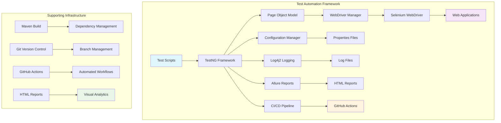
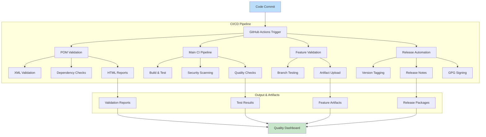
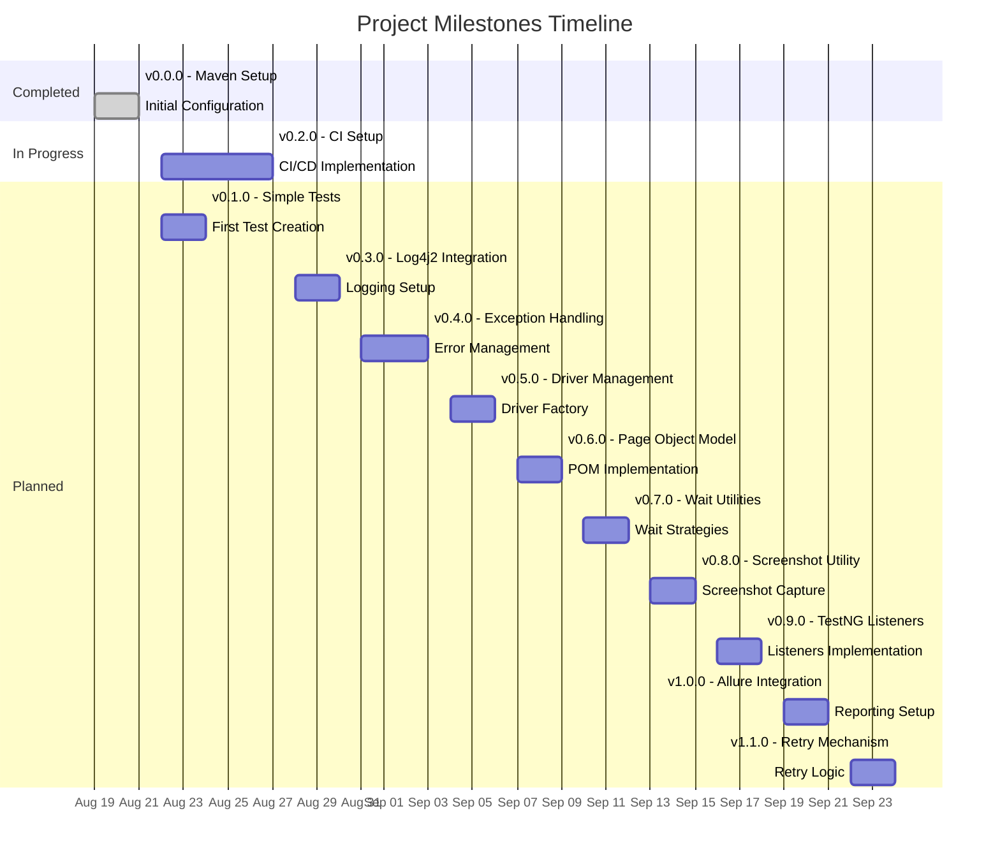
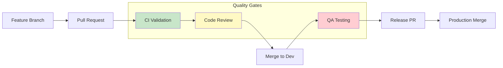
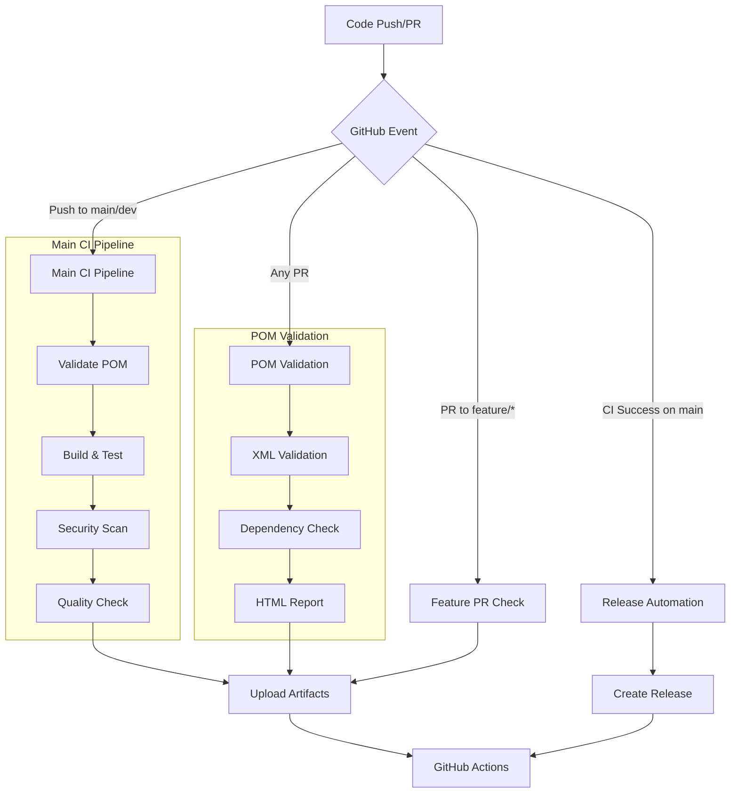
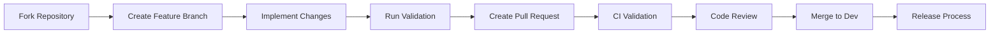

# 🚀 Java Selenium Hybrid Framework 

## 📊 Project Status

| Category | Badges |
|----------|--------|
| **Version** |    |
| **Activity** |    |
| **Size** |     |
| **CI/CD** |     |
| **Issues** |     |
| **Milestones** |   |
| **Tech Stack** |       |
| **License & Maintenance** |    |
| **Social** |     |

> A scalable and modular automation framework foundation using Java, Selenium WebDriver, and TestNG with comprehensive CI/CD integration.

---

## 📚 Table of Contents
1. [Project Overview](#-project-overview)
2. [Architecture](#-architecture)
3. [Project Structure](#-project-structure)
4. [Milestones](#-milestones)
5. [Branching Strategy](#-branching-strategy)
6. [CI/CD Pipeline](#-cicd-pipeline)
7. [Installation](#-installation)
8. [Usage](#-usage)
9. [Contributing](#-contributing)
10. [Author](#-author)
11. [License](#-license)
12. [Roadmap](#-roadmap)

---
## 🎯 Project Overview
This project establishes a robust foundation for Selenium WebDriver automation framework using **Java 21**, **TestNG**, **Maven**, and comprehensive **GitHub Actions CI/CD**.
The framework is designed for scalability, maintainability, and enterprise-grade quality assurance.

### 🎯 Key Objectives
- ✅ **Modular Architecture**: Scalable Page Object Model design
- ✅ **CI/CD Integration**: Full GitHub Actions automation
- ✅ **Quality Assurance**: Comprehensive validation and reporting
- ✅ **Documentation**: Professional guides and automation
- ✅ **Extensibility**: Easy to add new features and tests

---

## 🏗️ Architecture

### Framework Architecture Diagram

### CI/CD Pipeline Architecture

---

## 📁 Project Structure

```
java-selenium-java-selenium-hybrid-framework/
├── .github/
│ ├── workflows/ # GitHub Actions workflows
│ │ ├── main-ci.yml# Main CI pipeline
│ │ ├── pom-validation.yml # POM validation workflow
│ │ ├── feature-pr.yml # Feature branch validation
│ │ ├── release-pr.yml # Release automation
│ │ └── release-automation.yml # Release triggers
│ ├── scripts/ # Automation scripts
│ │ ├── pom-validator.sh # Enhanced POM validation (v1.4)
│ │ ├── milestones.sh# Milestone management
│ │ ├── issues.sh# Issue creation
│ │ ├── feature-pr.sh# Feature PR processing
│ │ └── release-pr.sh# Release PR processing
│ ├── issues/# Issue templates
│ │ └── ci-setup-issue.md# CI setup issue template
│ ├── features/# Feature PR templates
│ │ ├── maven-setup.md # Initial setup template
│ │ └── ci-setup.md# CI setup template
│ └── releases/# Release PR templates
│ ├── maven-setup-release.md # Initial release template
│ └── ci-setup-release.md# CI release template
├── src/
│ ├── main/java/ # Core framework classes
│ │ ├── config/# Configuration management
│ │ ├── drivers/ # WebDriver management
│ │ ├── pages/ # Page Object Model
│ │ ├── utils/ # Utility classes
│ │ └── exceptions/# Custom exceptions
│ └── test/java/ # Test classes
│ ├── tests/ # Test implementations
│ ├── listeners/ # TestNG listeners
│ └── base/# Base test classes
│ └── resources/ # Test configurations
│ ├── config.properties# Framework configuration
│ ├── log4j2.xml # Logging configuration
│ └── test-data/ # Test data files
├── Reports/ # Generated reports
│ ├── pom-validation-report.html # POM validation reports
│ └── allure-reports/# Allure test reports
├── pom.xml# Maven configuration
├── README.md# Project documentation
├── milestones.json# Project milestones
├── LICENSE# MIT License
└── .gitignore # Git ignore rules
```

---

## 📊 Milestones
### 📊 Milestone Progress Overview

###📋 Detailed Milestone Status
| Version | Feature                 | Status         | Target Date | Progress |
|---------|-------------------------|----------------|-------------|----------|
| v0.0.0  | Maven Initial Config    | ✅ Completed   | 2025-08-21  | 100%     |
| v0.1.0  | Simple Test Creation    | ✅ Completed   | 2025-08-24  | 100%     |
| v0.2.0  | CI Setup                | 🚧 In Progress | 2025-08-27  | 100%     |
| v0.3.0  | Log4j2 Integration      | ⏳ Planned     | 2025-08-30  | 0%       |
| v0.4.0  | Exception Handling      | ⏳ Planned     | 2025-09-03  | 0%       |
| v0.5.0  | Driver Management       | ⏳ Planned     | 2025-09-06  | 0%       |
| v0.6.0  | Page Object Model       | ⏳ Planned     | 2025-09-09  | 0%       |
| v0.7.0  | Wait Utilities          | ⏳ Planned     | 2025-09-12  | 0%       |
| v0.8.0  | Screenshot Utility      | ⏳ Planned     | 2025-09-15  | 0%       |
| v0.9.0  | TestNG Listeners        | ⏳ Planned     | 2025-09-18  | 0%       |
| v1.0.0  | Allure Integration      | ⏳ Planned     | 2025-09-21  | 0%       |
| v1.1.0  | Retry Mechanism         | ⏳ Planned     | 2025-09-24  | 0%       |

---

## 🌿 Branching Strategy

### Branch Protection Rules

---

## 🔁 CI/CD Pipeline

### Workflow Metrics

| Metric            | Value        | Target | Status |
|-------------------|--------------|--------|--------|
| Build Time        | ~2m 15s      | < 3m   | ✅     |
| Test Coverage     | 0% (initial) | > 80%  | ⏳     |
| Validation Checks | 23           | 25+    | 🚧     |
| Success Rate      | 100%         | > 95%  | ✅     |

### Workflow Architecture

---

## ⚙️ Installation

### Prerequisites
- Java 21+ JDK
- Maven 3.6+
- Git 2.30+
- GitHub account with repo access

### Quick Setup

```bash
# Clone repo
git clone https://github.com/Anuj-Patiyal/java-selenium-hybrid-framework.git
cd java-selenium-hybrid-framework

# Verify Java & Maven
java -version
mvn -version

# Build project
mvn clean install

# Run validation
chmod +x .github/scripts/pom-validator.sh
./.github/scripts/pom-validator.sh --html
```

---

## 🚀 Usage

### Run Tests

```bash
# Run all tests
mvn test

# Specific browser
mvn test -Dbrowser=chrome

# Specific group
mvn test -Dgroups=smoke

# Parallel execution
mvn test -Dparallel=classes -DthreadCount=4
```

### CI/CD

```bash
# Trigger workflow manually
gh workflow run main-ci.yml

# Check status
gh run list

# Download artifacts
gh run download <run-id>
```

---

## 🤝 Contributing
### Development Workflow


### Guidelines
- Branch naming: `feature/*`, `fix/*`
- Commit messages: follow **conventional commits**
- Add tests for new features
- Update documentation
- Run validation before PR

### Code Review Checklist
- ✅ CI checks passed
- ✅ Style guidelines followed
- ✅ Tests included
- ✅ Docs updated
- ✅ Backward compatible

---

## 👨‍💻 Author

**Anuj Kumar** 🏅 QA Consultant & Test Automation Architect
📧 [anujpatiyal@live.in](mailto:anujpatiyal@live.in)
🔗 [LinkedIn](https://www.linkedin.com/in/anuj-kumar-qa/)
🌐 [GitHub](https://github.com/Anuj-Patiyal)

---

## 📜 License

MIT License © 2025 [Anuj-Patiyal](https://github.com/Anuj-Patiyal)
```text
MIT License

Copyright (c) 2025 Anuj-Patiyal

Permission is hereby granted, free of charge, to any person obtaining a copy
of this software and associated documentation files (the "Software"), to deal
in the Software without restriction, including without limitation the rights
to use, copy, modify, merge, publish, distribute, sublicense, and/or sell
copies of the Software, and to permit persons to whom the Software is
furnished to do so, subject to the following conditions:

The above copyright notice and this permission notice shall be included in all
copies or substantial portions of the Software.

THE SOFTWARE IS PROVIDED "AS IS", WITHOUT WARRANTY OF ANY KIND, EXPRESS OR
IMPLIED, INCLUDING BUT NOT LIMITED TO THE WARRANTIES OF MERCHANTABILITY,
FITNESS FOR A PARTICULAR PURPOSE AND NONINFRINGEMENT. IN NO EVENT SHALL THE
AUTHORS OR COPYRIGHT HOLDERS BE LIABLE FOR ANY CLAIM, DAMAGES OR OTHER
LIABILITY, WHETHER IN AN ACTION OF CONTRACT, TORT OR OTHERWISE, ARISING FROM,
OUT OF OR IN CONNECTION WITH THE SOFTWARE OR THE USE OR OTHER DEALINGS IN THE
SOFTWARE.
```
---

## 🔮 Roadmap

### Short-term (4 weeks)
- ✅ Complete CI/CD pipeline (v0.2.0)
- 🚧 Implement Log4j2 integration (v0.3.0)
- 🚧 Add exception handling (v0.4.0)
- 🚧 Driver management (v0.5.0)

### Medium-term (8 weeks)
- Page Object Model
- Wait utilities
- Screenshot & video capture
- TestNG listeners

### Long-term (12+ weeks)
- Allure report integration
- Retry mechanism
- Cross-browser testing
- Mobile testing

---

> "First, solve the problem. Then, write the code." – John Johnson
> 
> Last updated: **August 2025** | Version: **0.2.0** | Documentation: ✅ Complete
