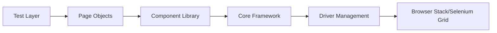

# 🚀 Java Selenium Hybrid Framework (v0.2.0)
**Enterprise-Grade Test Automation Solution**

[](https://opensource.org/licenses/MIT)


---

## 📖 Table of Contents
- [Framework Overview](#-framework-overview)
- [Features](#-features)
- [Technology Stack](#-technology-stack)
- [Getting Started](#-getting-started)
- [Project Structure](#-project-structure)
- [Configuration](#-configuration)
- [Running Tests](#-running-tests)
- [Release Notes](#-release-notes)
- [Roadmap](#-roadmap)
- [Contributing](#-contributing)
- [Author](#-author)
- [License](#-license)


```mermaid

graph LR
    A[Test Layer] --> B[Page Objects]
    B --> C[Component Library]
    C --> D[Core Framework]
    D --> E[Driver Management]
    E --> F[Browser Stack/Selenium Grid]

```

---

## 🌟 Framework Overview
Enterprise-grade test automation framework combining the best practices of:

- ✅ Modular design with configuration management
- ✅ Headless test execution with Selenium
- ✅ TestNG-powered structured test execution
- ✅ Maven-based dependency and build lifecycle

> Future enhancements include Page Object Model, CI/CD, reporting, and parallel execution.

---

## 🎯 Features

| Feature                         | Status      | Version |
|---------------------------------|-------------|---------|
| Maven initial setup             | ✅ Live     | v0.1.0  |
| First Simple Test               | 🚧 WIP      | v0.2.0  | 
| Configuration by .properties    | ⏳ Planned  | v0.3.0  | 
| CI Integration (GitHub Actions) | ⏳ Planned  | v0.4.0  |
---

## 🛠 Technology Stack
| Component           | Version     |
|---------------------|-------------|
| Java                | 21          |
| Selenium WebDriver  | 4.34.0      |
| TestNG              | 7.11.0      |
| Maven               | 3.9.10      |

---

## 🚀 Getting Started

### ✅ Prerequisites
- JDK 21+
- Maven 3.9+
- Chrome Browser
- ChromeDriver (in system PATH)

### 📥 Installation
```bash
git clone https://github.com/username/java-selenium-hybrid-framework.git
cd java-selenium-hybrid-framework
```

---

## 📂 Current Project Structure (v0.2.0)
```
📦 java-selenium-hybrid-framework    
├── 📂 src/test/java  
│   ├── 📂 tests                    # Test Classes  
│   │   ├── TextBoxTest.java        # Simple test    
├── 📜 pom.xml                      # Maven dependencies  
├── 📜 README.md                    # Project documentation  
├── 📜 LICENSE                      # MIT license  
└── 📜 .gitignore                   # Ignores (target/, logs/, etc.)  

```

---


## 🧪 Running Tests

```bash
# Run all tests
mvn clean test

# Run specific test
mvn test -Dtest=HomePageTest
```

---

## 📌 Release Notes
**Maven initial setup (v0.2.0)
### ✅ Features Included
    - Simple TestNG Test (src/test/java/tests/`TextBoxText.java`)
    - 📦 Dependencies:
        - `Selenium` `4.34.0`
        - `TestNG` `7.11.0`
    - 🔌 Plugins:
        - `Maven compiler plugin` `3.14.0` with:
            - `Java-21` release
        - `Maven clean plugin` `3.5.0`
    - 📁 `.gitignore` for Java/Maven
    - 📚 Professional `README.md` with:
    - Features
    - Roadmap
    - Getting Started
    - Author & License info

---

## 🗺 Roadmap
| Version | Target Date  | Features Included                          |
|---------|--------------|--------------------------------------------|
| v0.1.0  | 15-July-2025 | Maven initial setup                        |
| v0.2.0  | 15-July-2025 | First working test                         |
| v0.3.0  | 15-July-2025 | Configuration via properties | POM core    |
| v0.4.0  | 15-July-2025 | CI via GitHub Action                       |

---

## 👥 Contributing
1. Fork the repository
2. Create your feature branch: `git checkout -b feature/amazing-feature`
3. Commit your changes: `git commit -m 'Add some amazing feature'`
4. Push to the branch: `git push origin feature/amazing-feature`
5. Open a Pull Request

---

## 👤 Author

**ANUJ KUMAR** 🏅 QA Consultant & Test Automation Engineer
- 📧 Email: [anujpatiyal@live.in](mailto:anujpatiyal@live.in)
- 🌐 Website: *(coming soon)*
- 🔗 [LinkedIn Profile](https://www.linkedin.com/in/anuj-kumar-qa/)

---

## 📜 License
Distributed under the [MIT License](https://opensource.org/licenses/MIT).

> “First, solve the problem. Then, write the code.” – John Johnson

> This framework adheres to this principle with its configuration-first approach.