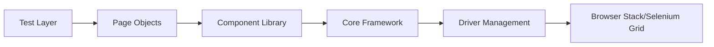

# 🚀 Java Selenium Hybrid Framework (`v0.2.0`)
**Enterprise-Grade Test Automation Solution**
> An end-to-end Selenium, TestNG, and Maven-based test automation framework for modern web applications.

[](https://opensource.org/licenses/MIT)


---

## 📖 Table of Contents
- [Framework Overview](#-framework-overview)
- [Features](#-features)
- [Technology Stack](#-technology-stack)
- [Getting Started](#-getting-started)
- [Project Structure](#-project-structure)
- [Configuration](#-configuration)
- [Running Tests](#-running-tests)
- [Release Notes](#-release-notes)
- [Roadmap](#-roadmap)
- [Contributing](#-contributing)
- [Author](#-author)
- [License](#-license)


```mermaid

graph LR
    A[Test Layer] --> B[Page Objects]
    B --> C[Component Library]
    C --> D[Core Framework]
    D --> E[Driver Management]
    E --> F[Browser Stack/Selenium Grid]

```

---

## 🌟 Framework Overview
This project is a highly maintainable, scalable, and modular hybrid test automation framework built using:

- ✅ Java 21, Selenium 4, TestNG 7.10.0, and Maven 3.9.6
- 🧩 Follows POM (Page Object Model) using PageFactory (upcoming)
- 🔐 Supports configuration via `.properties` files (upcoming)
- 🖥️ Cross-browser & headless execution support (planned)
- 💥 Designed for CI/CD pipelines via GitHub Actions (upcoming)
- 📸 ExtentReports and screenshots for test failures (upcoming)

> Future enhancements include Page Object Model, CI/CD, reporting, and parallel execution.

---

## 🎯 Features

| Feature                         | Status      | Version |
|---------------------------------|-------------|---------|
| Maven initial setup             | ✅ Live     | v0.1.0  |
| First Simple Test               | 🚧 WIP      | v0.2.0  | 
| Configuration by .properties    | ⏳ Planned  | v0.3.0  | 
| CI Integration (GitHub Actions) | ⏳ Planned  | v0.4.0  |
---

## 🛠 Technology Stack
| Component           | Version     |
|---------------------|-------------|
| Java                | 21          |
| Selenium WebDriver  | 4.34.0      |
| TestNG              | 7.11.0      |
| Maven               | 3.9.10      |

---

## 🚀 Getting Started

### ✅ Prerequisites
- JDK 21+
- Maven 3.9+
- Chrome Browser
- ChromeDriver (in system PATH)

### 📥 Installation
```bash
git clone https://github.com/username/java-selenium-hybrid-framework.git
cd java-selenium-hybrid-framework
```

---

## 📂 Current Project Structure 
```
📦 java-selenium-hybrid-framework-0.2.0   
├── 📂 src/test/java  
│   ├── 📂 tests                    # Test Classes  
│   │   ├── TextBoxTest.java        # Simple test    (new)
├── 📜 pom.xml                      # Maven dependencies (existing) 
├── 📜 README.md                    # Project documentation (Updated)  
├── 📜 LICENSE                      # MIT license  
└── 📜 .gitignore                   # Ignores (target/, logs/, etc.)  

```

---

## 🧪 Running Tests

```bash
# Run all tests
mvn clean test

# Run specific test
mvn test -Dtest=TextBoxTest
```

---

## 📌 Release Notes
**First Simple Test (`v0.2.0`)**
- ✅ Features Included
    - Simple TestNG Test (src/test/java/tests/`TextBoxTest.java`)
    - 📦 Dependencies:
        - `Selenium` `4.34.0`
        - `TestNG` `7.11.0`
    - 🔌 Plugins:
        - `Maven compiler plugin` `3.14.0` with:
            - `Java-21` release
        - `Maven clean plugin` `3.5.0`
    - 📁 `.gitignore` for Java/Maven
    - 📚 Professional `README.md` with:
    - Features
    - Roadmap
    - Getting Started
    - Author & License info

---

## 🗺 Roadmap
| Version | Feature                           | Status         | Target Date |
| ------ | ---------------------------------  | ---------------| ----------- |
| v0.1.0 | Maven initial configuration        | ✅ Done        | 21-Jul-2025 |
| v0.2.0 | First simple test (TextBoxTest)    | 🚧 In Progress | 21-Jul-2025 |
| v0.3.0 | Configuration setup                | ⏳ Upcoming    | 21-Jul-2025 |
| v0.4.0 | CI Integration                     | ⏳ Upcoming    | 21-Jul-2025 |
| v0.5.0 | Log4j Integration                  | 🔜 Planned     | 22-Jul-2025 |
| v0.6.0 | driver setup, DM, DF, BT classes   | ⏳ Planned     | 22-Jul-2025 |
| v0.7.0 | Page Object Model (POM) structure  | ⏳ Planned     | 22-Jul-2025 |
| v0.8.0 | Wait Strategy and Exception Hand.  | 🔜 Planned     | 23-Jul-2025 |
| v0.9.0 | Screenshot capture on failure      | 🔜 Planned     | 23-Jul-2025 |
| v1.0.0 | TestNG Listeners                   | 🔜 Planned     | 23-Jul-2025 |
| v1.1.0 | ExtentReports Integration          | 🔜 Planned     | 24-Jul-2025 |
| v1.2.0 | Retry Analyzer for flaky tests     | 🔜 Planned     | 24-Jul-2025 |
| v1.3.0 | Cross-browser support              | 🔜 Planned     | 24-Jul-2025 |
| v1.4.0 | CI/CD with GitHub Actions          | 🔜 Planned     | 25-Jul-2025 |

---


## 📸 Screenshots / Reports

_Coming soon: ExtentReports dashboard, test result screenshots, and summary._

---
## 👥 Contribution
Pull requests are welcome. For major changes, please open an issue first to discuss what you would like to change.

Planned:
- `CONTRIBUTING.md`
- Code style guidelines

---

## 👤 Author
**ANUJ KUMAR** 🏅 QA Consultant & Test Automation Engineer
- 📧 Email: [anujpatiyal@live.in](mailto:anujpatiyal@live.in)
- 🌐 Website: *(coming soon)*
- 🔗 [LinkedIn Profile](https://www.linkedin.com/in/anuj-kumar-qa/)

---

## 📜 License
Distributed under the [MIT License](https://opensource.org/licenses/MIT).

> “First, solve the problem. Then, write the code.” – John Johnson

> This framework adheres to this principle with its configuration-first approach.
